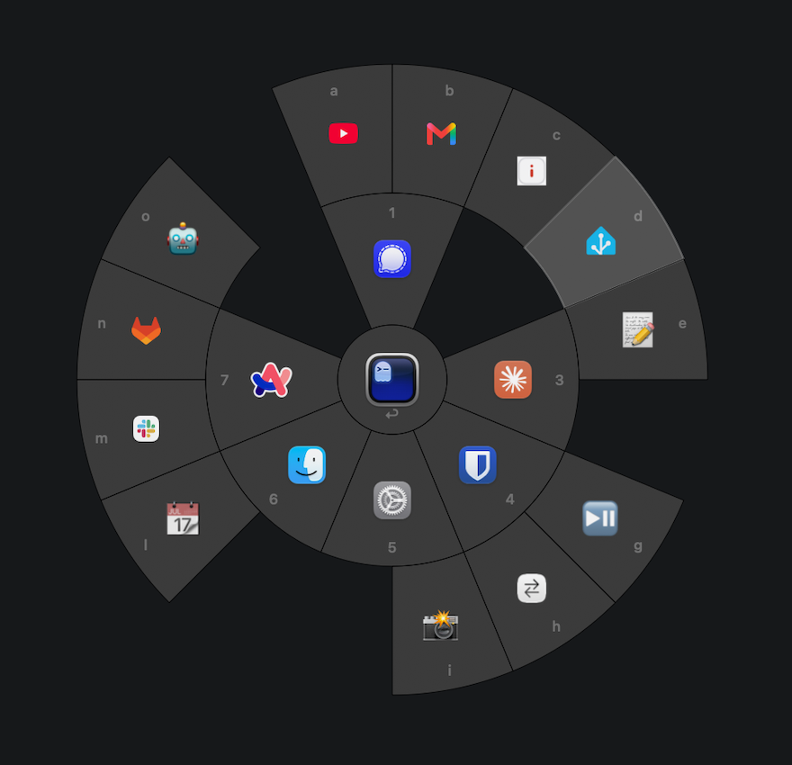

# Wiggle

<p align="center">
  
</p>

Wiggle is a Dock-less macOS accessory app. Shake the mouse pointer and a wheel of shortcut slots
opens around it; click a slot, or press its key, and it runs a keyboard shortcut, opens an app, or
runs an Apple Shortcut or AppleScript, right where you were working.

<p align="center">
  
</p>

### Why it exists

I wanted to eat pizza with my left hand while I worked. With only my right hand on the mouse, I
could not switch fast enough between YouTube in the browser and the terminal. I needed a faster way
that works with one hand on the mouse.

### Why the name

The first trigger was a wiggle of the mouse pointer: move it quickly left and right a few times, and
the wheel opens. Other triggers came later, but the name stayed.

## Why Wiggle

- **No hunting for a hotkey** — the wheel opens right where the pointer is.
- **More than one way in** — shake the pointer, bump a screen edge, tap or swipe the trackpad, or press a shortcut.
- **25 slots** — a center slot, 8 inner, and 16 outer, the outer ring hidden until assigned.
- **Any kind of action** — a shortcut, an app, an Apple Shortcut, or an AppleScript.
- **Stays out of the way** — no Dock icon, an optional menu bar item, no stolen keyboard focus.
- **Plain JSON config** — one file you can read, edit, or sync yourself.

## Getting Started

macOS 14 (Sonoma) or later. **Install via Homebrew:**

```sh
brew tap marcboeker/wiggle https://github.com/marcboeker/wiggle
brew trust --cask marcboeker/wiggle/wiggle
brew install --cask wiggle
```

The app is ad-hoc signed, so Gatekeeper blocks it the first time you open it — click **Done**, then
open **System Settings → Privacy & Security** and **Open Anyway**, or clear the quarantine flag:
`xattr -dr com.apple.quarantine /Applications/Wiggle.app`.

**Or build it from source:**

```sh
git clone https://github.com/marcboeker/wiggle.git && cd wiggle && make run
```

`make run` builds, ad-hoc signs, and opens `build/Wiggle.app`; see [Build and develop](#build-and-develop) below.

On first launch, macOS asks for **Accessibility** permission to watch the pointer and send
keystrokes; an AppleScript or Apple Shortcut slot also asks for **Automation** permission once.

## Triggers

A trigger is a gesture that opens the wheel. Switch each one on or off on the **Triggers** page in
Settings. Only **Shake the pointer** is on by default.

| Trigger | Gesture | Config name |
| --- | --- | --- |
| Shake the pointer | Move the pointer quickly left and right a few times. The wheel opens where the pointer was. | `wiggle` |
| Bump a screen edge | Push the pointer against a screen edge, pull back, and stop. The wheel opens where the pointer stops. | `screenEdge` |
| Tap with three fingers | Tap the trackpad with three fingers at once. The wheel opens at the pointer. | `threeFingerTap` |
| Tap with four fingers | Tap the trackpad with four fingers at once. The wheel opens at the pointer. | `fourFingerTap` |
| Swipe up with four fingers | Swipe up on the trackpad with four fingers. The wheel opens when the fingers lift. | `fourFingerSwipeUp` |
| Swipe down with four fingers | Swipe down on the trackpad with four fingers. The wheel opens when the fingers lift. | `fourFingerSwipeDown` |
| Press a shortcut | Press a key combination, or only modifiers such as the Hyper key. The wheel opens at the pointer. | `shortcut` |

macOS also uses the four-finger vertical swipes for Mission Control and App Exposé. To use them for
Wiggle, switch them off in **System Settings → Trackpad → More Gestures**.

<p align="center">
  
</p>

## Actions

An action is what a slot runs. Click a slot on the **Actions** page in Settings to assign it, or
drag it to move it to a different slot.

| Action | Result | Config `kind` |
| --- | --- | --- |
| Keyboard shortcut | Sends a key combination, for example `cmd+shift+4`, to the app in front. | `shortcut` |
| App | Opens an app, or brings it to the front. | `app` |
| Apple Shortcut | Runs a shortcut from the Shortcuts app. | `appleShortcut` |
| AppleScript | Runs an AppleScript. | `appleScript` |

An app slot shows the app icon. Every other slot shows an emoji or an image that you select.

<p align="center">
  
</p>

## Use

| Action | Result |
| --- | --- |
| Do a trigger gesture | The wheel opens |
| Click a slot, or press its key | Runs the slot |
| Escape, or a click outside the wheel | Closes it |
| Another app comes to the front | Closes it |

The center slot runs on Return, the inner ring on `1`-`8`, and the outer ring on `a`-`p` once
assigned. A menu bar item, on by default, offers **Settings…** (`⌘,`) and **Quit Wiggle** (`⌘Q`);
`⌘,` also opens Settings from the wheel, which has **General**, **Actions**, and **Triggers** pages.

<p align="center">
  
</p>

## Configuration

Slots and settings live in `~/.config/wiggle/config.json` (`--config <path>` for another file). An
image face, if a slot has one, is a PNG next to it in `~/.config/wiggle/icons/`.

```json
{
  "overlayOpacity": 0.92,
  "rings": [
    { "0": { "app": { "bundleIdentifier": "com.apple.Terminal", "name": "Terminal" }, "kind": "app" } },
    { "1": { "kind": "shortcut", "label": "📷", "shortcut": "cmd+shift+4" } },
    {}
  ],
  "triggerShortcut": "cmd+ctrl+alt+shift",
  "triggers": ["wiggle", "shortcut"]
}
```

`rings` holds one object per ring (center, inner, outer) keyed by slot number, with no key for an
empty slot; `triggers` lists the enabled gestures — without it, only `wiggle` is on. `triggerShortcut` is the
shortcut for the `shortcut` trigger.

## Build and develop

| Target | Action |
| --- | --- |
| `make build` | Compile without bundling. |
| `make bundle` | Build, assemble, and sign `build/Wiggle.app`. |
| `make run` | Stop any running copy, bundle, and open it. |
| `make stop` | Quit a running copy. |
| `make install` | Stop any running copy, bundle, and copy it to `/Applications` (or `~/Applications` if `/Applications` is not writable). Set `INSTALL_DIR` to override. |
| `make test` | Run the unit tests. |
| `make logs` | Stream the app's log messages. |
| `make permissions` | Open Privacy & Security → Accessibility. |
| `make clean` | Remove all build output. |

`SIGN_ID` picks the codesigning identity `make bundle` uses; unset, it auto-detects an Apple
Development identity or falls back to an ad hoc signature (`-`, what CI and a release use).

## Limits

Secure input (password fields, `sudo`, the lock screen) blocks every event tap, so close the wheel
with a click outside there instead of a key. A shortcut macOS already claims, `command`+`space`
for example, is answered by the system and not Wiggle, which posts keys at the hardware level.

## License

MIT, see [LICENSE](LICENSE).
