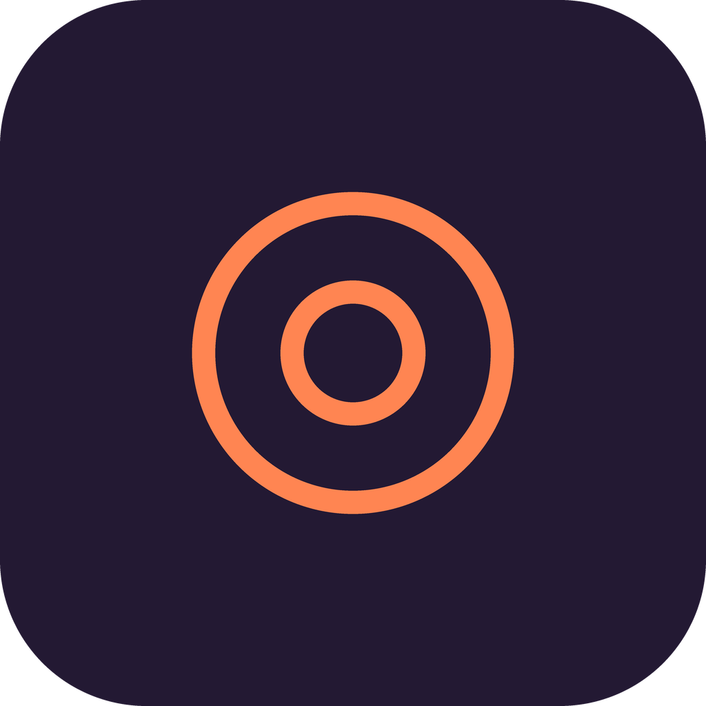
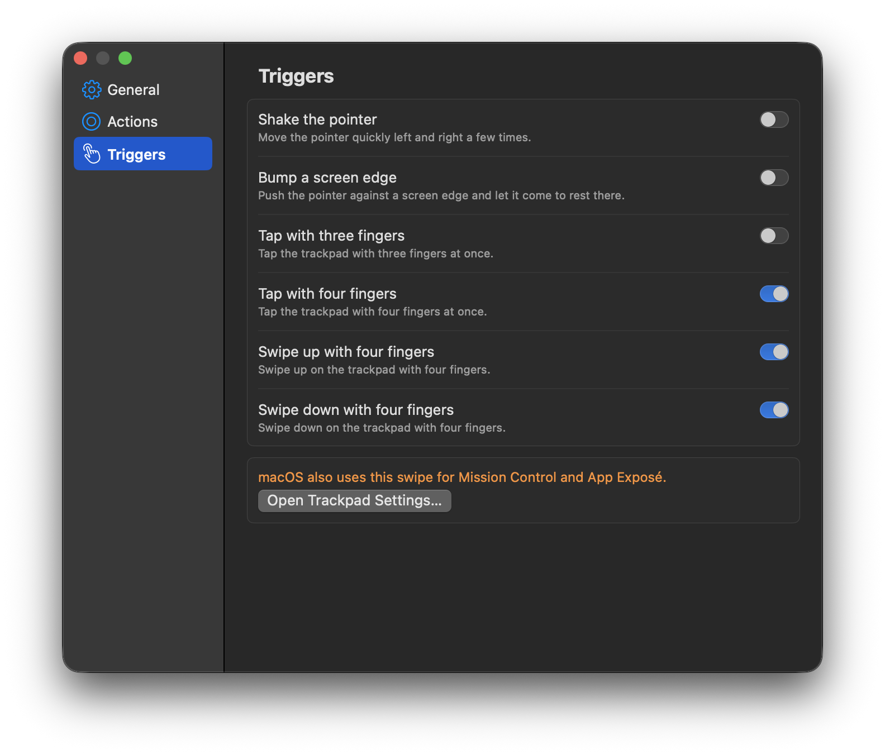
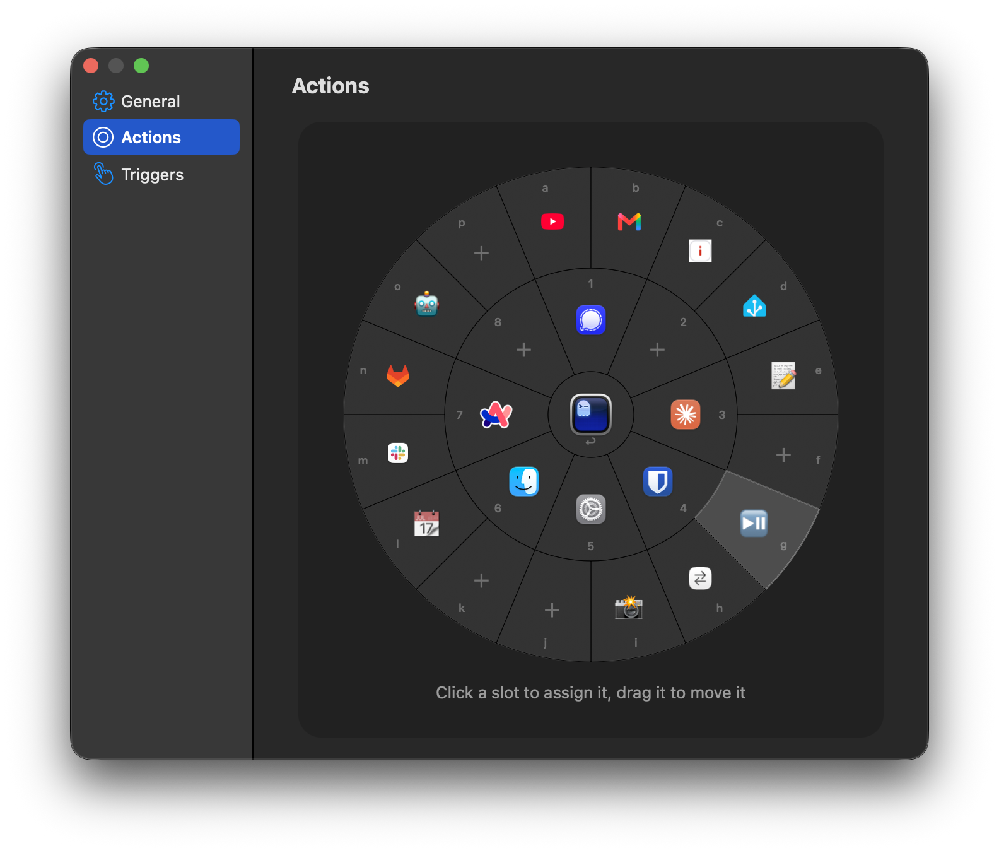

# Wiggle

<p align="center">
  
</p>

Switch apps and run shortcuts without the keyboard. Shake the mouse pointer, a wheel of actions
opens where the pointer is, and you click one. Wiggle is a free macOS app, named after its first
trigger: a wiggle of the pointer.

<p align="center">
  
</p>

## The problem

I wanted to eat pizza with my left hand while I worked. With only my right hand on the mouse, I
could not switch fast enough between YouTube in the browser and the terminal.

The general problem: your hand is on the mouse, but the action you need is a hotkey on the
keyboard, or an icon in the Dock on the other side of the screen. Wiggle puts these actions next to
the pointer.

## How it works

1. Do a trigger gesture, for example shake the pointer. The wheel opens around the pointer.
2. Click a slot, or press its key. The slot runs its action.
3. The wheel closes. You continue where you were.

Escape, a click outside the wheel, or another app that comes to the front also closes the wheel.

- **Opens at the pointer** — your hand stays on the mouse, and your eyes stay where you work.
- **Many actions** — up to 25 slots: a center slot, an inner ring of 8, and an outer ring of 16
  that shows only when you use it.
- **Stays out of the way** — no Dock icon, and it does not take the keyboard focus.
- **Plain JSON config** — one file that you can read, edit, or keep in your dotfiles.

## Install

macOS 14 (Sonoma) or later. Install with Homebrew:

```sh
brew tap marcboeker/wiggle https://github.com/marcboeker/wiggle
brew trust --cask marcboeker/wiggle/wiggle
brew install --cask wiggle
open /Applications/Wiggle.app
```

Wiggle is not notarized by Apple. The cask removes the macOS quarantine flag after the install, so
that Gatekeeper does not block the app. `brew trust` lets the cask do this.

### Permissions and privacy

At the first launch, macOS asks for **Accessibility** permission. Wiggle needs it to see the
trigger gestures and to send keyboard shortcuts. An AppleScript or Apple Shortcut slot also asks
for **Automation** permission one time.

Wiggle has no network code. It does not record your input. It writes only to `~/.config/wiggle` and to its
own preferences.

### Your first minute

The wheel is empty after the install. To solve the browser-and-terminal problem from above:

1. Open **Settings** from the menu bar item.
2. On the **Actions** page, click the center slot and select **Previous App**.
3. Click inner slot 1 and select your browser. Click inner slot 2 and select your terminal.
4. Shake the pointer, and click a slot.

Now a shake and a click on the center slot switches between the two apps you used last. The key
for the center slot is Return, so a shake and Return also does it.

## Examples

| Slot | Action | Result |
| --- | --- | --- |
| Center | Previous App | Switch back and forth between two apps |
| 1, 2, 3 | App | Open your browser, terminal, and editor |
| 4 | Keyboard shortcut `cmd+shift+4` | Take a screenshot of an area |
| 5 | Keyboard shortcut | Mute or unmute yourself in a video call |
| 6 | Apple Shortcut | Switch dark mode on or off |

## Triggers

A trigger is a gesture that opens the wheel. Switch each one on or off on the **Triggers** page in
Settings. Only **Shake the pointer** is on by default.

- **Shake the pointer** — move the pointer quickly left and right a few times.
- **Bump a screen edge** — push the pointer against a screen edge, pull back, and stop.
- **Tap the trackpad** with three or four fingers.
- **Swipe up or down** on the trackpad with four fingers. The wheel opens when the fingers lift.
- **Hold a shortcut** — a key combination, or only modifiers such as the Hyper key. The wheel shows while you hold it and closes when you let go.

The wheel opens at the pointer. macOS uses the four-finger vertical swipes for Mission Control and
App Exposé. To use them for Wiggle, switch them off in **System Settings → Trackpad → More
Gestures**.

<p align="center">
  
</p>

## Actions

An action is what a slot runs. On the **Actions** page in Settings, click a slot to assign an
action, or drag a slot to move it.

- **Keyboard shortcut** — sends a key combination to the app in front.
- **App** — opens an app, or brings it to the front.
- **Previous App** — brings back the app that you used before the app in front.
- **Apple Shortcut** — runs a shortcut from the Shortcuts app.
- **AppleScript** — runs an AppleScript.

An app slot shows the app icon. Other slots show an emoji or an image that you select. You can
also give each slot a color.

| Ring | Keys |
| --- | --- |
| Center | Return |
| Inner ring | `1` to `8` |
| Outer ring | `a` to `p` |

<p align="center">
  
</p>

## Settings and configuration

Open **Settings** from the menu bar item, or press `⌘,` while the wheel is open. If you hide the
menu bar item, open Wiggle.app again to open Settings.

Wiggle keeps all slots and settings in `~/.config/wiggle/config.json`. You never have to edit the
file, but you can. See [docs/configuration.md](docs/configuration.md) for every key and the
shortcut spelling.

## Limits

- In password fields, at `sudo` prompts, and at the lock screen, macOS blocks the keys that Wiggle
  needs. Close the wheel there with a click, not with a key.
- Shortcuts that macOS itself uses, such as `cmd+space`, go to macOS and not to the app in front.

## Alternatives

Raycast and Alfred start from the keyboard. BetterTouchTool can do much more, but it is paid and
has many settings. The Logitech Actions Ring needs a Logitech mouse. Wiggle does one thing: it
puts your actions next to the pointer, with any mouse or trackpad.

## Uninstall

```sh
brew uninstall --cask wiggle
```

Add `--zap` to also delete the config in `~/.config/wiggle`.

## Development

To build Wiggle from source, see [docs/development.md](docs/development.md).

## License

MIT, see [LICENSE](LICENSE).
